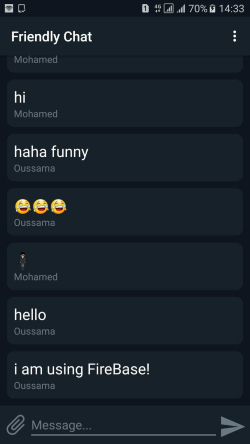

# FireBaseChatApp

## Description:
a simple android app that uses FireBase and implements it's features to ensure fluent messaging functions.

`the google-services.json file is not included in this project, if you want to use the app make sure to use your own firebase project and include your google services settings in it.`

## Featres:
* Instant messaging.
* Authentication using google accounts or email/password combo.
* Sending images and receiving them.
* Offline messages are stored and sent once internet connection is restaured.

## Tools & languages: 
* Android Studio (IDE).
* Java (Logic code).
* XML (Design).
* Paint.Net (Image editting).

## Screenshots: 

## Contribution:
Feel free to `fork` this project and add whatever you like. If you have any suggestions or any comments please feel free to contact me or to open an issue, use free license art assets please.
P.S: the google-services.json file is not included in this project, if you want to use the app make sure to use your own firebase project and include your google services settings in it. 

## Team:
[Jetlighters](https://github.com/JetLightStudio) having fun.
